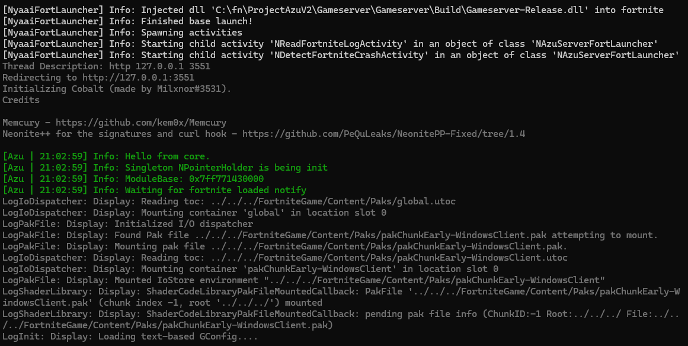
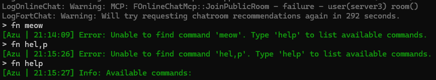
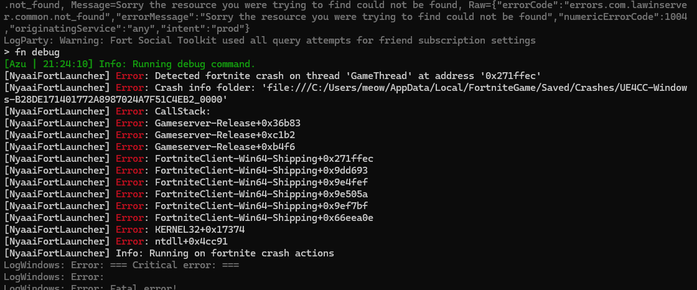

# NyaaiFortLauncher

NyaaiFortLauncher is a highly customizable CLI launcher for fortnite.

By default all it will do is start the fortnite process, the rest is to be configured in a config file.


## Project patron


## Notable features

### Printing the fortnite log in the same command line as the launcher lives in

- Color fortnite log that contains a predefined prefix. In the image that prefix set to "[Azu".
- Add actions triggered by the contents of the fortnite log.



### Not just Fortnite.

This launcher can be used for other games, I've (parkie) used this to help me waste less time while developing my CS:GO cheat. 

### Forwarding commands to fortnite

The "fn" command will put everything after fn into the stdin of fortnite. All you have to do in your dll to read commands is to std::cin.



### Detect fortnite crashes

This works by checking new entries in FortniteGame\Saved\Crashes\ and checking if the process id inside CrashContext.runtime-xml matches the one started by the launcher.

It's really useful cause it prints a clickable link to the folder with the crash .dmp, so you can open it right away.



## Usage

### 1. Download source and compile

### 2. Create a .nfort config file

NyaaiFortLauncher works by launching .nfort config files.
A config file is a text file that defines a NEngine object (`TObjectTemplate<NEngine>`).

Config example:
```
NBasicEngine
{
	bAutoStartLauncher: {true}

	LauncherTemplate:
	{
		NFortLauncher
		{
			FortniteBuildPath: {"15.30\\"}
		
			FortniteLaunchArguments:
			{
				"-epicapp=Fortnite -epicenv=Prod -epiclocale=en-us -epicportal -skippatchcheck"
				" -nobe -fromfl=eac -fltoken=3db3ba5dcbd2e16703f3978d"
				" -AUTH_LOGIN=example@example.com -AUTH_PASSWORD=example -AUTH_TYPE=epic"
				" -nosplash"
			}
			
			PreFortniteLaunchActions:
			{
				{
					NCreateProcessAction
					{
						FilePath: {"FortniteGame\\Binaries\\Win64\\FortniteLauncher.exe"} 
						bCreateSuspended: {true}
					}
				}
				{
					NCreateProcessAction
					{
						FilePath: {"FortniteGame\\Binaries\\Win64\\FortniteClient-Win64-Shipping_EAC.exe"} 
						bCreateSuspended: {true}
					}
				}
			}
			
			PostFortniteLaunchActions:
			{
				{
					NInjectDllIntoFortniteAction
					{
						DllPath: {"G:\\fn\\dlls\\CobaltThreadDescriptionUrl.dll"}
						DllThreadDescription: {"http 127.0.0.1 3551"}
					}
				}
			}
			
			Activities:
			{
				{
					NReadFortniteLogActivity
					{
						bPrintFortniteLog: {true}
						ColoredPrintPrefix: {"[Azu"}
						bOnlyPrintLogWithColoredPrintPrefix: {false}
						LogTriggeredActions:
						{
							{
								TriggerString: {"Region "} 
								bTriggerOnlyOnce: {true}
								Action: 
								{
									NInjectDllIntoFortniteAction { DllPath: {"C:\\fn\\ProjectAzuV2\\Client\\Build\\Client-Release.dll"} }
								}
							}
						}
					}
				}
				{
					NDetectFortniteCrashActivity
				}
			}
		}
	}
}
```

**To see the full list of classes run `NyaaiFortLauncher.exe --help`** or look in the code

In this example I use NBasicEngine, which is an engine that manages one launcher instance (The program supports multiple instances).

NyaaiFortLauncher is not bound to a specific launcher instance. In NBasicEngine you can use the stop command to stop a launcher instance, and then when you are ready to start a new one, you can use the start command. This is useful when frequently recompiling dlls during development, you don't have to close and open a console, you can just keep one open all the times.

The syntax should be quite self-explanatory from the example.
The syntax for `TObjectTemplate<SomeClass>` (what the config is) is:
```
ClassDerivedFromSomeClass
{
    MemberPropertyName: {Value}
}
```
You specify the class and overrides for its member properties.

The syntax for arrays is the following:
```
{
	Elem1Value
}
{Elem2Value}
{
    Elem3Value
}
{
	Elem4Value
}
```
There is no commas between elements, you can do newlines and spaces as you wish.

**Paths can be relative to the location of the config, or relative to the fortnite build path.**

### Actions
**Actions are events you can fire (Like a function call).**

In the example config I run two NCreateProcessAction's to create suspended FortniteLauncher.exe and FortniteClient-Win64-Shipping_EAC.exe processes.

I use the NInjectDllIntoFortniteAction to inject a redirect right after the game launches.

I also set a NInjectDllIntoFortniteAction action to execute when the string "Region " appears in the fortnite log (This happens when fortnite gets to the logging in screen) to inject my client dll.

### Activities
**Activities are objects that have a lifetime and are ticked.**

In the example config I add the NReadFortniteLogActivity activity to run on the launcher, which prints the fortnite log and gives me the ability to further bind actions when certain phrases appear in the fortnite log.

I also add the NDetectFortniteCrashActivity, which is prints info about fortnite crashes when they happen.

### 3. Associate .nfort config files with NyaaiFortLauncher.exe
- Right click on your config file -> Open with -> Choose another app -> More apps -> Scroll Down -> Look for another app on this PC
- Choose NyaaiFortLauncher.exe
- Check "Always use this app to open .nfort files"
- Click OK

### 4. Use the launcher

If you have any errors with the syntax in the config, it should say what it is.

If you can't get it to work or have found a bug open a github issue and I will help.

You can see the full list of classes by doing `NyaaiFortLauncher.exe --help`


## One config for multiple builds

To be able to define one config for a lot of builds add a NBuildStoreActivity to the engine like so:
```
NBasicEngine
{
	Activities:
	{
		{
			NBuildStoreActivity
			{
				FortniteBuildPaths:
				{
					{"15.30\\"}
                    {"13.40\\"}
					{"10.40\\"}
				}
			}
		}
	}
}
```

When a launcher instance starts it will pull the selected build from the build store.

You can change the selected build with the `SelectBuild {Name or Index}` command. You can print the list of builds with the `ListBuilds` command.

You might also want to set `bAutoStartLauncher: {false}` on the engine, so it doesn't auto start before you specify the build.

Build selection is saved on disk (for a specific config).

When doing this you don't specify FortniteBuildPath on the launcher cause it will be overwritten by the selection in NBuildStoreActivity

## **Important**
- **Do not alloc console in your dlls or redirect stdout in any way cause NReadFortniteLogActivity will not be able to work**
- **When logging in your dlls do cout.flush or wcout.flush or otherwise logs might not appear instantly**

## TODO: make a more complete readme

 Ask questions in github issues.

 Contributions are welcome.
